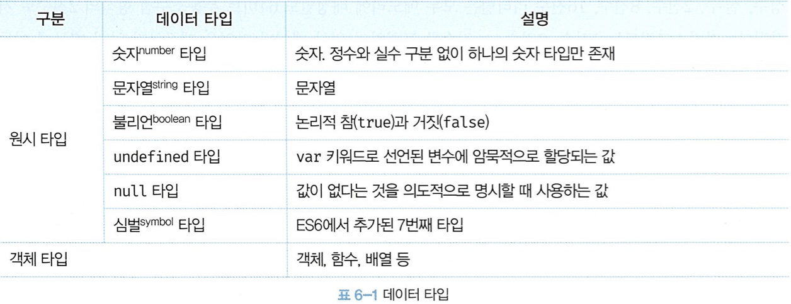
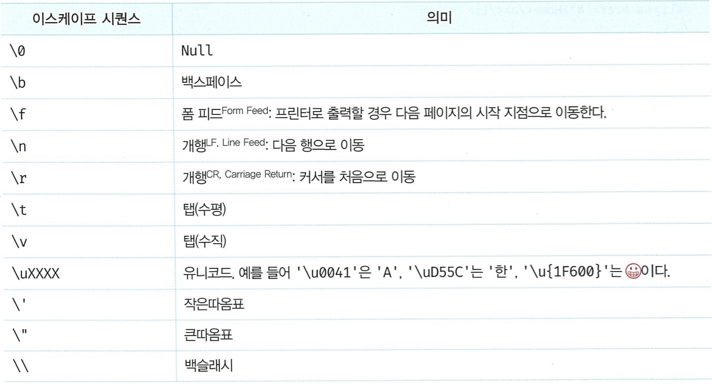

# 06장 데이터 타입

값의 종류로, 모든 값은 데이터 타입을 가짐

- 7개의 데이터 타입을 가짐
- 원시 타입과 객체 타입으로 분류



- 값을 생성한 목적과 용도에 따라 다른 데이터 타입을 지정

<br />

## 6.1 숫자 타입

**하나**의 숫자 타입만 존재 !

ECMAScript 사양에 따르면 숫자 타입의 값은 배정밀도 64비트 부동소수점 형식을 따름

→ 모든 수를 **실수**로 처리

- `Infinity(양의 무한대)`, `-Infinity(음의 무한대)`, `NaN(산수 연산 불가)` 값도 표현 가능

<br />

## 6.2 문자열 타입

텍스트 데이터를 나타내는 데 사용

- 0개 이상의 16비트 유니코드 문자(UTF-16)의 집합으로 전 세계 대부분의 문자 표현 가능
- 작은따옴표(’ ‘), 큰따옴표(” “), 백틱(` `)으로 텍스트를 감쌈
  - 작은따옴표를 사용하는게 가장 일반적
  - 키워드나 식별자 같은 토큰과 구분하기 위함
- 자바스크립트의 문자열은 원시 타입이고 변경 불가능한 값
  - 문자열이 생성되면 그 문자열을 변경할 수 없다는 뜻!

<br />

## 6.3 템플릿 리터럴

ES6부터 도입된 표기법으로 편리한 문자열 처리 기능을 제공

- 런타임에 일반 문자열로 변환되어 처리됨
- 백틱을 사용해서 표현

### 6.3.1 멀티라인 문자열

일반 문자열 내에서는 줄바꿈이 허용되지 않으므로 이스케이프 시퀀스를 사용해야 함


> **라인 피드와 캐리지 리턴**
> 개행 문자는 텍스트의 한 줄이 끝났음을 표시하는 문자(문자열)로, 라인피드(LF, Line Feed)와 캐리지 리턴(CR, Carriage Return)이 있다
> `라인 피드(\n)` : 커서를 정지한 상태에서 종이를 한 줄 올리는 것
> `캐리지 리턴(\r)` : 종이를 움직이지 않고 커서를 맨 앞줄로 이동하는 것

현대의 컴퓨터 운영체제는 서로 다른 체계의 개행 방식을 사용함

>

`BUT` 템플릿 리터럴 내에서는 이스케이프 시퀀스를 사용하지 않고도 줄바꿈과 공백이 적용됨

```jsx
var template = `<ul>
	<li><a href="3">Home</a></li>
</ul>`;
console.log(template);

/*
<ul>
	<li><a href="#">Home</a></li>
</ul>
*/
```

### 6.3.2 표현식 삽입

일반 문자열에서는 문자열 연산자 +를 사용해서 문자열을 연결할 수 있다

`BUT` 템플릿 리터럴 내에서는 표현식 삽입을 통해 삽입 가능

- ${ } 으로 표현식을 감쌈

```jsx
var first = "Ung-mo";
var last = "Lee";

// ES5: 문자열 연결
console.log("My name is " + first + " " + last + "."); // My name is Ung-mo Lee.

// ES6: 표현식 삽입
console.log(`My name is ${first} ${last}.`); // My name is Ung-mo Lee.
```

- 표현식의 평가 결과가 문자열이 아니더라도 문자열로 타입이 강제 변환되어 삽입됨

```jsx
console.log(**`**1 + 2 = ${1 + 2}**`**); // 1 + 2 = 3
// 표현식 1 + 2의 평가 결과는 숫자 3이지만 문자열로 변환됨

console.log(**'**1 + 2 = ${1 + 2}**'**); // 1 + 2 = ${1 + 2}
// 일반 문자역에서의 표현식 삽입은 문자열로 취급됨
```

<br />

## 6.4 불리언 타입

논리적 참을 나타내는 `true`와 거짓을 나타내는 `false`

- 조건문에서 자주 사용

## 6.5 undefined 타입

개발자가 의도적으로 할당한 값이 아닌, **자바스크립트 엔진이 변수를 초기화 할 때 사용하는 값**

- 변수를 참조했을 때 undefined 가 반환된다면 참조한 변수가 선언 이후 값이 할당된적이 없는, 초기화되지 않은 변수임을 알 수 있음
- 개발자가 의도적으로 undefined를 변수에 할당한다면 본래 취지에 어긋나고 혼란을 줌으로 권장되지 X

> **선언과 정의**
> JS의 undefined에서의 정의란 변수에 값을 할당하여 변수의 실체를 명확히 하는 것
> 다른 프로그래밍 언어에서는 선언과 정의를 엄격히 구분하는 경우가 있으나
> 자바스크립트의 경우 그 구분이 모호하다
> 변수를 선언하면 암묵적으로 정의가 이루어지기 때문

ECMAScript에서 변수는 ‘선언한다’ / 함수는 ‘정의한다’로 표현

>

## 6.6 null 타입

1. 변수에 값이 없다는 것을 의도적으로 명시할 때 사용(의도적 부재)
   - 변수에 null을 할당하는 것 == 이전에 참조하던 값을 더 이상 참조하지 않겠다
     → 자바스크립트 엔진은 이 공간에 대해 가비지 콜렉션을 수행
2. 함수가 유효한 값을 반환할 수 없는 경우 명시적으로 null을 반환

   e.g. `document.querySelector` 메서드가 조건에 부합하는 HTML 요소를 검색할 수 없는 경우

## 6.7 심벌 타입

ES6에서 추가된 7번째 타입으로, 변경 불가능한 원시 타입의 값

다른 값과 중복되지 않는 유일무이한 값

- 이름이 충돌할 위험이 없는 객체의 유일한 프로퍼티 키를 만들기 위해 주로 사용
- Symbol 함수를 호출해 생성
  - 이때 생성된 심벌값은 외부에 노출되지 않음

## 6.8 객체 타입

원시 타입과는 근본적으로 다름

- 자바스크립트는 객체 기반의 언어, 자바스크립트를 이루는 거의 모든 것이 객체

11장에서 자세히

## 6.9 데이터 타입의 필요성

### 6.9.1 데이터 타입에 의한 메모리 공간의 확보와 참조

**값 저장**

변수에 할당되는 값의 **데이터 타입에 따라** **확보해야 할 메모리 공간의 크기가 결정**됨

e.g. 숫자 100을 저장하기 위해서 자바스크립트 엔진은 리터럴 100을 숫자 타입의 값으로 해석하고, → 8바이트의 메모리 공간을 확보하고, → 100을 2진수로 저장함.

**값 참조**

값을 참조할 때 **한번에 읽어 들여야 할 메모리 공간의 크기 결정**

e.g. score 변수에 숫자 타입의 값이 할당되어 있음 → 자바스크립트 엔진이 해당 변수를 숫자 타입으로 인식 → 8바이트 단위로 메모리 공간에 저장된 값을 읽어들임.

### 6.9.2 데이터 타입에 의한 값의 해석

**값 해석**

메모리에서 읽어들인 2진수를 데이터 타입에 따라 다르게 해석

e.g. 0100 0001을 숫자로 해석하면 65, 문자열로 해석하면 ‘A’

## 6.10 동적 타이핑

### 6.10.1 동적 타입 언어와 정적 타입 언어

**동적 타입 언어** 변수에 할당할 수 있는 값의 데이터 타입을 사전에 정의해야 함(명시적 타입 선언)

- 변수의 타입 변경 불가
- 선언한 타입에 맞는 값만 할당 가능
- 컴파일 시점에 타입 체크 수행
  - 타입의 일관성을 강제함 → 안정적인 코드

e.g. C, C++, Java, Kotlin, Go, Haskell, Rust, Scala

**동적 타입 언어** 선언이 아닌 할당에 의해 변수의 타입을 결정

- 재할당에 의해 언제든지 변수의 타입 변경 가능
- 어떠한 데이터 타입의 값이라도 할당 가능

e.g. 자바스크립트, Python, PHP, Ruby, Lisp, Perl

<aside>
💫 **변수는 타입을 가지는가?**
**X**, 변수에 할당되어 있는 **값이 타입을 가져**서 그에 의해 변수의 타입이 동적으로 결정되는 것

</aside>

### 6.10.2 동적 타입 언어와 변수

➕ 동적 타입 언어는 데이터 타입에 대해 무감각해질 정도로 편리

➖

변화하는 변수 값을 추적하기 어려울 수 있음

값을 확인하기 전에는 타입을 확신할 수 없음

자바스크립트 엔진에 의해 타입이 자동으로 변환되기도 함

→ 유연성 ⬆️ 신뢰성 ⬇️

**변수 사용 시 주의 사항**

- 변수는 꼭 필요한 경우에 한해 제한적으로 사용(변수의 개수가 많을수록 오류 발생 확률 높아짐)
- 변수의 유효 범위(스코프)는 최대한 좁게 만들어야 함
- 전역 변수는 최대한 사용하지 않도록
- 변수 보다는 상수를 사용해 값의 변경을 억제
- 변수의 목적이나 의미를 파악할 수 있도록 네이밍
